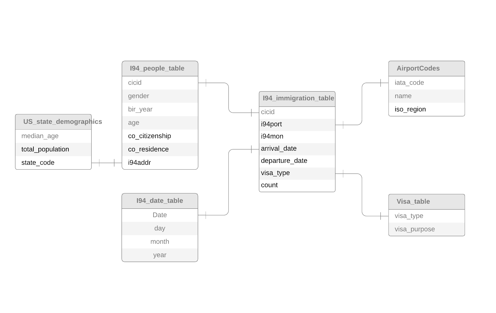

# Udacity_DataEngineering-Capstone-Project
Define scope of the project and the required data to build an ETL model

### Project Scope
I have decided to proceed with the Udacity provided project. The dataset provided is a huge one - the US I94 Immigration Data. A few other unrelated smaller datasets have also been provided. 

### The Data
Four datasets have been considered:
- **I94 Immigration Data**: This data comes from the US National Tourism and Trade Office.
- **U.S. City Demographic Data**: This data comes from OpenSoft. 
- **Airport Code Table**: This is a simple table of airport codes and corresponding cities. 

The **immigration Data** contains the following information:

cicid | i94yr | i94mon | i94cit | i94res | i94port | arrdate | i94mode | i94addr | depdate | i94bir | i94visa | count | dtadfile | visapost | occup | entdepa | entdepd | entdepu | matflag | biryear | dtaddto | gender | insnum | airline | admnum | fltno | visatype

The **Cities data** contains the following information:

City | State | Median Age | Male Population | Female Population | Total Population | Number of Veterans | Foreign-born | Average Household Size | State Code | Race | Count

The **Airport Code Data** contains the following fields:
Ident | type | name | elevation_ft | continent | iso_country | iso_region | municipality | gps_code | iata_code | local_code | co-ordinates

### Questions that can be asked
Before we proceed with the ETL process we need to focus on the questions we would like to ask
1. Top 3 ports with highest number of immigrants for a given year
2. States/regions with the ports seeing most number of immigrants for a given month in a year
3. Number of males and females immigrants for a given month in a year
4. Number of males and females immigrants for a given airport
5. US states/regions preferred by Female Immigrants over the years
6. Avg age of immigrants for a given month in a year
7. Most common visa type for immigrants for a given month and year or US region (state)
8. Most common purpose of visit for immigrants for a given month and year or US region (state)

To answer the questions above, we proceed with the ETL as follows

### The Data model
The conceptual data model has been designed as below

### Tools
We use Apache Spark to read the data from S3, process the data and store the analytical tables back on S3.
The I94 Immigration file are huge SAS files. The most convenient way would be to read and process them using spark.

### ETL pipeline

1. Read the raw data from S3 into staging tables 
2. Clean the data
- Drop the columns with most null values
- Drop rows with null values for certain columns
3. Perform transformations on the data
- Convert the arrival date and the 
4. Use the data to create the fact and dimensions tables
5. Save the fact and dimension tables back on S3 as parquet files

### Executing on AWS EMR cluster
 1. Enable SSH to the master node
 2. SCP the etl script to the master node
 3. For reading SAS files into spark dataframe, we need 2 jars 
 - spark-sas7bdat-3.0.0-s_2.11 [Github link](https://github.com/saurfang/spark-sas7bdat)
 - parso-2.0.11.jar
 5. scp the jar files to the master node and move them to the /spark/lib/jars folder
 6. Execute the etl script using the following command 
 **/usr/bin/spark-submit --master yarn etl_capstone.py  saurfang:spark-sas7bdat:3.0.0-s_2.11**

### Data Quality checks
We run a check for the following:
1. The data types of the columns in the fact and dimension tables
2. Query for the questions we needed answeres to

**1. Ports in US that see highest entry of immigrants**
df_top=df_imm.groupBy("i94port").agg(f.sum('count').alias("total")).sort(desc("total")).show(3)

| i94port |   total |
| ------- |-------- |
|    NYC|374263.0|
|    MIA|276574.0|
|    LOS|238106.0|

2. Number of males, females entering US at MIA port and in the month of April
 df_imm.join(df_ppl, df_imm.cicid == df_ppl.cicid).filter((df_imm["i94port"]=="MIA") &(df_imm['i94mon']=='4')).groupBy("gender").sum("count").show()
 
|gender|sum(count) |
| ------ | -------- |
|     F|  139409.0|
|     M|  137161.0|
|     U|       2.0|
|     X|       2.0|

### Freuency of data updates
The above pipeline has been modelled to partition the vast immigration data by port and by month. The data can thus be updated at the end of every month and the etl pipeline can executed to have the updated data for every port in US
New monthly files can be read in and data can be appended to the existing parquet analytical files in S3.

### Future scenarios
1. If the data was increased by 100x.
IF the data increased by 100x - We would need to increase number of worker nodes in the EMR cluster using spark. Spark allows us to hv multiple tasks running in parallel. increasing number of partitions and hence the number of tasks will speed things up

2. If the pipelines were run on a daily basis by 7am.
We need the pipelines to be run daily by 7am, we need to use Apache airflow to schedule the run. 
For using Airflow, the SAS files will first need to be converted to csv files and then read into redshift database. I am not aware of a way to read SAS files directly into Redshift.
These steps can be configured in an airflow dag and daily runs can be scheduled for the new data only.

3. If the database needed to be accessed by 100+ people.
Once on Redhist, AWS has the capability to allow 100+ connections.
 
